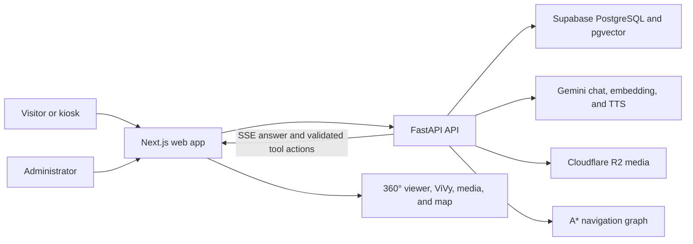

<div align="center">

# TVU Virtual Campus Tour

**An AI-assisted 360° campus exploration platform for Trà Vinh University.**

[](https://github.com/thhieu2904/tvu-virtual-campus-tour/actions/workflows/ci.yml)
[](frontend/package.json)
[](backend/requirements.txt)
[](backend/pyproject.toml)

[Public demo](https://www.tvu-tour.site) ·
[API documentation](https://api.tvu-tour.site/api/docs) ·
[Video demo](https://drive.google.com/drive/folders/1xHmkKiam8fIFhoG9Mmh9xhfhsHYsqel7?usp=sharing) ·
[Vietnamese documentation](https://github.com/thhieu2904/tn-da22tta-110122221-nguyenthanhhieu-tvutour) ·
[Report an issue](https://github.com/thhieu2904/tvu-virtual-campus-tour/issues/new)

</div>

TVU Virtual Campus Tour lets prospective students and visitors explore the university through connected 360° scenes, talk to the 3D guide **ViVy** in Vietnamese, ask questions grounded in university documents, and receive visual route guidance across campus.

This is more than a static panorama viewer. The AI agent can return validated tool actions together with its answer, allowing the interface to navigate to a place, display location media, open the campus map, or retrieve facts from the RAG knowledge base in the same conversation turn.

> The public visitor experience is anonymous. Authentication is required only for the administration area. AI, database, storage, and administration features require the external services described in [Configuration](#configuration).


## Why this project matters

Conventional university websites provide information, but they rarely help a remote visitor understand where a place is, what it looks like, and how to get there. This project combines those tasks in one reusable educational platform:

- immersive 360° exploration for remote orientation;
- Vietnamese question answering grounded in institution-provided documents;
- AI-driven interface actions instead of text-only answers;
- A* routing on a real campus navigation graph;
- an administration workspace for locations, media, documents, mascots, and cache jobs;
- a kiosk mode suitable for exhibitions and on-campus displays.

The same architecture can be adapted by another school or public institution by replacing the location graph, media collection, knowledge documents, branding, and service credentials.

## Recognition and pilot evidence

| Item | Evidence |
| --- | --- |
| Provincial recognition | **Giải Khuyến khích** (Honorable Mention), *Hội thi Olympic Tin học khối cán bộ, công chức, viên chức và lực lượng vũ trang* in Vĩnh Long |
| Pilot usage | **1,104 interactive sessions** and **1,896 chat messages** recorded during the project pilot |
| Maintainer | [Nguyễn Thanh Hiếu (@thhieu2904)](https://github.com/thhieu2904) |

Pilot session counts include demonstrations and testing activity; they are not presented as unique-user counts.

## Core capabilities

| Area | What is implemented |
| --- | --- |
| Immersive tour | Linked 360° scenes, hotspots, location information, image/video panels, and mobile/kiosk layouts |
| AI guide | 3D mascot, streaming Vietnamese chat, configurable Gemini models, speech output, and conversation sessions |
| Grounded answers | Document ingestion, chunking, Gemini embeddings, PostgreSQL/pgvector retrieval, and source-aware RAG responses |
| Agent actions | Validated `navigate_to`, `show_media`, `toggle_map`, and `search_documents` tool calls |
| Navigation | Dynamic A* pathfinding, cached routes, map overlays, and an educational step-by-step A* visualizer |
| Administration | Location, link, category, document, media, mascot, voice, kiosk, and cache-job management |
| Operations | Health checks, Dockerized backend, structured service layers, CI lint/build checks, and backend regression tests |

## How it works



The backend follows a layered flow:

```text
HTTP router → service/business logic → repository/data access → PostgreSQL
```

The RAG agent first decides whether it needs a UI action, document retrieval, or both. UI actions are normalized and checked against active locations before being returned to the frontend.

## Technology stack

| Layer | Main technologies |
| --- | --- |
| Frontend | Next.js 16, React 19, TypeScript, Zustand, Three.js / React Three Fiber, Pannellum, Tailwind CSS |
| Backend | Python 3.11, FastAPI, SQLAlchemy, Pydantic, Server-Sent Events |
| AI | Google Gemini chat, embeddings, function calling, and TTS |
| Data | Supabase PostgreSQL with pgvector |
| Media | Cloudflare R2 through its S3-compatible API |
| Deployment | Vercel frontend and containerized FastAPI backend |

## Repository layout

```text
tvu-virtual-campus-tour/
├── .github/workflows/       # Continuous integration and deployment workflows
├── backend/
│   ├── app/
│   │   ├── ai/              # Prompts, Gemini client, and tool declarations
│   │   ├── repositories/    # Database access
│   │   ├── routers/         # Public and admin HTTP routes
│   │   └── services/        # RAG, chat, TTS, cache, media, and routing logic
│   ├── scripts/             # Schema, seed, cache, and maintenance utilities
│   └── tests/               # Backend unit and regression tests
├── frontend/
│   └── src/
│       ├── app/             # Visitor and admin routes
│       ├── features/        # Tour, chat, admin, mascot, and navigation features
│       └── shared/          # Shared API and browser utilities
├── CONTRIBUTING.md
├── SECURITY.md
└── README.md
```

## Quick start

### Prerequisites

- Git
- Node.js 20 or newer and npm
- Python 3.11
- a PostgreSQL database with the `vector` extension (Supabase is supported)
- a Google Gemini API key for chat, embeddings, and TTS
- Supabase and Cloudflare R2 credentials for the complete admin/media workflow

### 1. Clone the repository

```bash
git clone https://github.com/thhieu2904/tvu-virtual-campus-tour.git
cd tvu-virtual-campus-tour
```

### 2. Start the backend

```bash
cd backend
python -m venv .venv
```

Activate the environment:

```powershell
# Windows PowerShell
.\.venv\Scripts\Activate.ps1
```

```bash
# macOS or Linux
source .venv/bin/activate
```

Install the application and development dependencies:

```bash
python -m pip install --upgrade pip
python -m pip install -r requirements-dev.txt
```

Create the local configuration file:

```powershell
# Windows PowerShell
Copy-Item .env.example .env
```

```bash
# macOS or Linux
cp .env.example .env
```

At minimum, configure `DATABASE_URL`, `GEMINI_API_KEY`, and `CORS_ORIGINS`. Then initialize the schema and optionally add the three-location demo dataset:

```bash
python -m scripts.migrate
python -m scripts.seed
uvicorn app.main:app --reload --host 127.0.0.1 --port 8000
```

`scripts.seed` is idempotent for an existing location dataset: it skips seeding when locations already exist.

### 3. Start the frontend

Open a second terminal from the repository root:

```bash
cd frontend
npm ci
```

Create `frontend/.env.local` from [`frontend/.env.example`](frontend/.env.example), then use the local backend URL:

```dotenv
NEXT_PUBLIC_API_URL=http://localhost:8000
NEXT_PUBLIC_SUPABASE_URL=https://your-project.supabase.co
NEXT_PUBLIC_SUPABASE_ANON_KEY=your-anon-key
NEXT_PUBLIC_KIOSK_MODE=false
```

Run the application:

```bash
npm run dev
```

Local endpoints:

- visitor experience: <http://localhost:3000>
- administration login: <http://localhost:3000/admin/login>
- OpenAPI/Swagger: <http://localhost:8000/api/docs>
- backend health: <http://localhost:8000/api/health>

## Configuration

Never commit `.env`, `.env.local`, service-role keys, database credentials, or R2 secret keys.

### Backend

The complete template is [`backend/.env.example`](backend/.env.example).

| Group | Variables | Purpose |
| --- | --- | --- |
| Application | `APP_NAME`, `APP_VERSION`, `DEBUG`, `CORS_ORIGINS` | Service metadata and allowed browser origins |
| Gemini | `GEMINI_API_KEY`, agent/answer model settings, embedding and TTS settings | Agent reasoning, grounded answers, vectors, and speech |
| Database/auth | `DATABASE_URL`, `SUPABASE_URL`, `SUPABASE_ANON_KEY`, `SUPABASE_SERVICE_ROLE_KEY` | PostgreSQL access and admin authentication |
| Object storage | `R2_ENDPOINT_URL`, access keys, bucket, and public URL | 360° images, videos, documents, models, and generated audio |

`CORS_ORIGINS` is a JSON array, for example:

```dotenv
CORS_ORIGINS=["http://localhost:3000","https://www.example.edu"]
```

### Frontend

The template is [`frontend/.env.example`](frontend/.env.example).

- For local development, set `NEXT_PUBLIC_API_URL=http://localhost:8000`.
- In production, leave `NEXT_PUBLIC_API_URL` unset to use the same-origin `/api` proxy, or set it to the public API origin and allow the frontend origin in backend CORS.
- `API_PROXY_ORIGIN` and `MEDIA_PROXY_ORIGIN` are optional server-side deployment settings; they are not browser credentials.
- `NEXT_PUBLIC_KIOSK_MODE=true` enables kiosk-specific interaction safeguards.

## Run the backend with Docker

The repository currently containerizes the **backend only**. PostgreSQL and object storage remain external services.

```bash
cd backend
cp .env.example .env
# Fill in the required values before continuing.
docker compose up -d --build
docker compose ps
curl http://localhost:8000/api/health
```

## Tests and quality checks

Backend:

```bash
cd backend
python -m pip install -r requirements-dev.txt
python -m pytest -q
python -m ruff check app tests
```

Frontend:

```bash
cd frontend
npm ci
npm run lint
npm run build
```

The backend tests use local mocks and do not require production Gemini, Supabase, or R2 credentials.

## API reference

When the backend is running, the complete OpenAPI schema is available at `/api/docs` and `/api/openapi.json`.

| Method | Endpoint | Purpose |
| --- | --- | --- |
| `GET` | `/api/health` | Service health and version |
| `GET` | `/api/locations` | Active campus locations |
| `GET` | `/api/locations/{slug}` | Location details and links |
| `GET` | `/api/nav/path` | A* route between two locations |
| `POST` | `/api/chat/session` | Create an anonymous visitor session |
| `POST` | `/api/chat` | Stream or return an AI response and tool actions |
| `POST` | `/api/tts` | Generate or retrieve speech audio |
| `POST` | `/api/admin/ingest` | Ingest a document into the RAG knowledge base |

Admin endpoints live under `/api/admin` and require authenticated access.

## Public deployment

- Web application: <https://www.tvu-tour.site>
- API health: <https://api.tvu-tour.site/api/health>
- OpenAPI/Swagger: <https://api.tvu-tour.site/api/docs>

The frontend, API, and public media use separate origins. A loaded frontend page does not by itself prove that chat and data services are healthy, so deployment verification should include the API health endpoint and one agent tool action.

## Contributing and security

- Read [`CONTRIBUTING.md`](CONTRIBUTING.md) before opening a pull request.
- Report vulnerabilities through the private process in [`SECURITY.md`](SECURITY.md), not a public issue.
- Do not commit private university documents, personal data, production exports, or media without redistribution permission.

## Documentation

- [Vietnamese academic submission repository](https://github.com/thhieu2904/tn-da22tta-110122221-nguyenthanhhieu-tvutour)
- [Video demonstration on Google Drive](https://drive.google.com/drive/folders/1xHmkKiam8fIFhoG9Mmh9xhfhsHYsqel7?usp=sharing)
- [Architecture image](https://raw.githubusercontent.com/thhieu2904/tn-da22tta-110122221-nguyenthanhhieu-tvutour/main/docs/images/kien-truc-tong-the.png)
- [RAG pipeline image](https://raw.githubusercontent.com/thhieu2904/tn-da22tta-110122221-nguyenthanhhieu-tvutour/main/docs/images/pipeline-rag.png)
- [Function-calling flow image](https://raw.githubusercontent.com/thhieu2904/tn-da22tta-110122221-nguyenthanhhieu-tvutour/main/docs/images/function-calling.png)

## License and media rights

A dedicated source-code license has not yet been committed. Until one is selected, public access to this repository does not by itself grant reuse rights.

The Trà Vinh University name and logo, campus photographs and 360° captures, videos, documents, institutional data, voices, and character/media assets may have rights separate from the source code. They must not be assumed to fall under a future software license. See the maintainer discussion before redistributing those assets.
